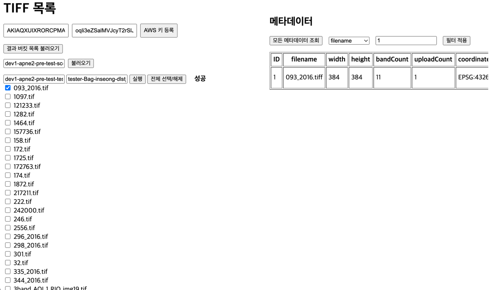

# Tiff convert project


jar 다운로드 : https://drive.google.com/file/d/12LgPJcZOk6Q6KMyhKjJAX7CTZvPMg-lD/view?usp=drive_link

파일이름 : testProject-boot.jar

## 소개

S3 버킷에서 TIFF 파일을 다운로드하여 COG 포맷으로 변환한 뒤, 목표 S3 버킷에 업로드하는 **Spring Boot Reactive** 애플리케이션. 

GeoTIFF 메타데이터를 저장·조회하고, 업로드 기록을 로깅 테이블에 관리합니다.

- **Database**: H2 (in-memory) + R2DBC
- **Web**: Spring WebFlux  
- **Language**: Kotlin

## 기술 스택

| 구성요소            | 버전            |
|--------------------|-----------------|
| Spring Boot        | 3.4.4           |
| Spring WebFlux     | 3.4.4           |
| Spring Data R2DBC  | 3.4.4           |
| R2DBC H2 Driver    | 1.0.0.RELEASE   |
| AWS SDK (S3, CRT)  | 2.20.x / 0.29.x |
| Kotlin             | 1.9.25          |
| Java               | 21              |

## 아키텍처 및 흐름

1. **AWS 인증정보 입력** (웹 페이지를 통해 Access Key ID / Secret Access Key 등록)
2. **S3 목록 조회** (원본 버킷 내 파일 리스트 확인)
3. **파일 선택 및 변환 요청** (선택된 TIFF 파일을 COG로 변환)
4. **변환 완료 후 목표 버킷으로 업로드**
5. **변환 및 업로드 기록 DB 저장**

## 설치 및 실행

1. 레포지토리 클론  
```bash
git clone https://github.com/dlstjd92/TestProject.git
cd TestProject
```

2. Gradle 빌드 및 실행  
```bash
./gradlew clean build
./gradlew bootRun
혹은 jar 파일 다운로드 후
java -jar testProject-boot.jar
```

3. 브라우저 접속  
```
http://localhost:8080
```

4. 웹페이지 상단에서 AWS Access Key ID / Secret Access Key 입력 후 사용
   - 조회할 버킷 입력 후 불러오기 클릭
   - 조회할 파일들 중 변환할 파일 체크
   - 업로드할 버킷명과 디렉토리명 입력
   - 변환 실행
   - 메타데이터 조회버튼으로 인메모리 DB에 저장된 파일 메타데이터 확인
   - 셀렉트 박스로 필터 검색 가능


## 주요 API 명세

| API Endpoint | 메소드 | 요청 데이터 | 설명                             |
|:-------------|:------|:------------|:-------------------------------|
| `/aws/credentials` | POST | `{ accessKeyId, secretAccessKey }` | AWS 인증 정보 등록 및 S3 클라이언트 초기화    |
| `/S3/getList` | POST | `{ bucketName }` | S3 버킷 내 파일 목록 조회               |
| `/CogConverter/convert` | POST | `{ bucketIn, key, bucketOut, targetKey }` | 단일 TIFF 파일을 변환 및 업로드 (웹 사용 안함) |
| `/CogConverter/batch-convert` | POST | `{ bucketIn, keys, bucketOut, targetKey }` | 여러 TIFF 파일을 일괄 변환 및 업로드        |
| `/logs` | GET | 없음 | 변환 및 업로드 기록 전체 조회 (웹 사용 안함)    |
| `/metadata` | GET | 없음 | 전체 GeoTIFF 메타데이터 조회            |
| `/metadata/filter` | GET | 쿼리 파라미터 (`filename`, `bucketName` 등) | 조건 기반 메타데이터 조회                 |

- **주의사항**: S3 작업 전에 반드시 AWS 인증정보를 입력해야 합니다.
- 입력된 인증정보는 메모리 상에만 저장되며 서버에 따로 저장되지 않습니다.

## 사용한 외부 라이브러리 및 목적

| 라이브러리 | 목적 |
|:---|:---|
| Spring Boot | 애플리케이션 구동 및 설정 |
| Spring WebFlux | 비동기 논블로킹 웹 서버 구축 |
| Spring Data R2DBC | R2DBC를 통한 비동기 데이터베이스 접근 |
| R2DBC H2 Driver | 인메모리 H2 데이터베이스 연결 |
| AWS SDK for S3 | S3 버킷 파일 다운로드 및 업로드 API 호출 |
| AWS S3 Transfer Manager | 대용량 S3 파일 전송 최적화 |
| AWS CRT (Common Runtime) | 네이티브 전송 가속화 라이브러리 |

---

## EC2 인스턴스 이용한 각 스팩별 테스트 결과

타켓 버킷의 모든 객체를 동시에 변환 명령을 내렸을 때, 환경 및 소요시간
| 인스턴스 타입 | vCPU | 메모리 | 네트워크 대역폭      | 스토리지 | 동시 처리 (concurrency) | 멀티파트 크기 | 총 소요 시간 (초) |
|:--------------|:----:|:------:|:---------------------|:---------|:-----------------------:|:-------------:|:-----------------:|
| t2.medium     | 2    | 4 GiB  | Low to Moderate       | EBS 전용 | 3                       | 64 MB         | 실패 (메모리 부족) |
| t3.medium     | 2    | 4 GiB  | 최대 5 Gbps           | EBS 전용 | 3                       | 64 MB         | 실패 (메모리 부족) |
| t3.large      | 2    | 8 GiB  | 최대 5 Gbps           | EBS 전용 | 3                       | 64 MB         | 894.54초          |
| t3.xlarge     | 4    | 16 GiB | 최대 5 Gbps           | EBS 전용 | 3                       | 64 MB         | 626.14초          |
| m6i.large     | 2    | 8 GiB  | 최대 12.5 Gbps        | EBS 전용 | 3                       | 64 MB         | 839.49초          |

---

### 추가 설명
- 최대 17.9GB의 고용량 파일 병렬작업에는 메모리 4GB는 부적합한것으로 판명. 필요시 동시 작업 수를 줄여 구동할 수 있으나 속도가 현저히 느릴것으로 예상.
- t3.large(거의 15분)을 기준으로 t3.xlarge(컴퓨팅 파워 업그레이드), m6i.large(네트워크 대역폭 업그레이드)를 해본 결과
  처음 가정인 네트워크 속도가 해당 작업에 절대적일것이란 예상을 깨고 코어와 메모리를 업그레이드 하는것이 훨씬 유리한것으로 판명.
  추가로 메모리가 클수록 동시 작업 스레드수를 늘릴 수 있기 때문에 실험 결과보다 더 빠르게 작업하는것도 가능할것으로 예상됨.

---
## 인프라 구성


S3에 업로드 시 자동으로 작업이 진행되는 ECS - Fargate 서버리스 아키텍쳐 구성.

1. S3에 파일 업로드 시 이벤트가 자동으로 트리거되어 SQS Queue에 전달된다.
 - SQS Queue를 선택한 이유는 예상치 못한 트래픽 급증 상황에서도 작업이 누락되지 않도록 보장할 수 있기 때문이다. 또한 Dead Letter Queue(DLQ)를 통해 폴링 실패 시 재시도가 가능하도록 하여 안정성을 높였다.
2. SQS Queue에서 Lambda를 이용해 Fargate 클러스터에 이벤트를 전달한다.
 - SQS는 Fargate에 직접 이벤트를 전달할 수 없기 때문에 일반적으로 EventBridge 또는 Lambda를 중개로 사용해야 한다. 이 중 트래픽 급증 시에도 작업 누락을 방지하는 것이 중요하다고 판단하여, SQS + Lambda 아키텍처를 선택하였다.
3. Fargate 클러스터는 별도 서버 관리 없이(서버리스) 필요에 따라 작업을 자동으로 실행하고, 트래픽에 맞게 스케일을 조정한다.
 - 로드 밸런서(ALB) 및 오토스케일링 정책을 통해 트래픽 변화에 따라 작업 수를 유동적으로 스케일 인/아웃할 수 있도록 구성하였다. 어플리케이션과 실행 환경은 하나의 Docker 이미지로 패키징하여 배포 및 실행한다.
 - 람다가 아닌 Fargate를 선택한 이유는 S3에서 다운로드/업로드할 이미지들이 최대 17.9GB로 고해상도 위성 이미지를 다루기엔 너무 가볍다고 생각했다. 람다의 최대 메모리 지원은 10GB로 효율이 굉장히 떨어질것으로 예상해 살짝 무겁더라도 관리가 필요없는 서버리스 형태인 Fargate를 선택함.
4. 작업 중 발생하는 메타데이터는 Aurora Serverless를 사용해 저장한다.
 - Aurora Serverless를 선택한 이유는 추가적인 인프라 관리 없이 자동으로 스케일 인/아웃되며, 비용 최적화가 가능하기 때문이다. 트래픽이 많지 않을 경우에는 단순한 Aurora(Provisioned)로 구성해도 무방하다.
5. 어플리케이션이 작업 완료 시 결과 파일을 S3 Output 버킷에 업로드한다.
 - 또한 선택적으로 CloudWatch Logs를 사용하여 어플리케이션 상태 모니터링, 에러 탐지, 로그 분석 등을 수행할 수 있도록 구성하였다.

---

## 면접 질문 예상

1. Spring Web flux에 멀티모듈 구성으로 API를 구성했다. 이 과정에서 특별히 가장 기억에 남는 순간이 있다면?
   - 먼저 멀티 모듈 구성은 크게 어렵지 않았습니다. 평소에 클린 아키텍쳐, 클린 코드 등의 책을 읽으며 코드의 독립성이 가독성과 유지보수에 얼마나 영향을 끼치는지 잘 알고있었고, 실제로 서비스를 구현하며 멀티 모듈 구성을 해본것은 처음이기에 재미있게 코드를 작성했습니다 각각의 의존성을 낮추고 기능별 디렉토리를 모듈단위로 나눠 각각의 모듈이 독립적으로 작동하도록 구성하였습니다.
   - WebFlux 역시 그동안 이론으로만 학습했던 다중 스레드 처리와 병렬성 개념을 실제로 적용해볼 수 있는 좋은 기회였습니다. 평소에 구할 수 있었던 데이터셋은 한정적이었지만, 이번 프로젝트에서는 S3 버킷에 저장된 저용량부터 대용량까지 다양한 파일을 활용하여, 여러 환경에서 병렬 처리 효율성을 연구하며 서비스를 구성할 수 있었습니다. 현재 로직은 3개의 동시 작업 수(concurrency)를 유지하면서, 각 파일당 최대 5개의 멀티파트 다운로드를 병렬로 처리하도록 구성하였습니다. 이론상으로는 하나의 스레드가 동시에 15개의 파일 다운로드를 관리하는 구조이며, 아직 최적화 여지가 남아 있습니다. 특히, 동시 작업 수와 최대 대역폭을 조정해가며 다양한 환경에서 무리 없이 작업을 안정적으로 실행할 수 있도록 수치를 튜닝했습니다. 로컬 개발 환경에서는 운영체제가 리소스를 유연하게 관리해주기 때문에 동시 작업 수를 크게 늘려도 문제가 없었으나, EC2 인스턴스에 배포하여 테스트했을 때는 메모리 부족으로 인해 일부 작업이 실패하는 문제를 경험했습니다. 이 과정을 통해 운영체제와 서버 환경이 리소스를 어떻게 다르게 관리하는지를 체감할 수 있었고, 리소스 최적화의 중요성을 다시 한번 느낄 수 있었습니다.
   
2. 다수의 서버, 인스턴스에서 동작할 수 있음을 염두에 두었는가?
   - 대부분의 로직이 독립적으로 구성되어있어 충돌할 일은 없을것으로 예상됩니다. 그러나 저의 로직에선 S3에 업로드를 위한 시퀸스 번호 증가 문제를 DB에 uploadCount를 관리해 해당 숫자로 시퀸스 값을 읽어오는 방법을 선택했습니다. 이는 시퀸스 갱신을 위해 지속적으로 S3버킷을 스캔하는것은 비효율적이라고 판단하여 DB에서 시퀸스를 관리하도록 했기 때문입니다. 이로 인해 다수의 인스턴스, 다수의 쓰레드 작업으로 "경합"이 발생해 시퀸스가 겹치거나 하는등으로 작업이 누락될 위험이 있습니다. 이 문제를 해결하기 위해 DB에서 값을 탐색하고 해당 uploadCount를 읽어오는 일련의 작업을 하나의 트랜잭션으로 묶어 사이에 다른 작업이 끼어들지 못하도록 조치하였습니다. 현재 h2 inmemory 데이터베이스를 사용해 Returning 문법을 사용하지 못하였고 다중경합이 발생하게 될 경우 시퀸스가 겹치지 않는것은 보장하지만 작업 요청순서대로 시퀸스가 갱신되는것은 보장하지 않습니다. 그렇기 때문에 별도로 Log 테이블을 만들어 받은 요청에 대해 실시간으로 로그를 수집하여 논리적인 순서를 판단할 수 있도록 하였습니다. 위 아키텍쳐처럼 Aurora Serverless를 사용하여 다시 리펙토링할 기회가 주어진다면 Returning 문법으로 쿼리문을 간편화 하는 한편, PostgreSQL의 프로시져 기능을 활용하여 DB레벨에서 순서를 보장할 수 있도록 로직을 구성해보고 싶습니다.
3. 이번 프로젝트를 진행하면서 특히 고려한 부분이 있다면?
   - 과제에 제시된 “멀티 모듈 구성”, “서비스 확장에 따른 기능 추가 용이성”, “다수의 서버 및 인스턴스에서 동작”이라는 키워드를 보고, 이번 프로젝트에서는 특히 독립성과 확장성을 중점적으로 고려했습니다.
멀티 모듈 구조를 통해 각 기능별 모듈이 독립적으로 동작하고, 모듈 간 의존성을 최소화하여, 추후 새로운 기능을 추가하더라도 기존 코드에 미치는 영향을 최소화할 수 있도록 설계했습니다.
또한 다수의 서버나 인스턴스 환경에서도 안정적으로 동작할 수 있도록, 경합이 발생할 가능성이 있는 구간을 미리 분석하여 하나의 트랜잭션으로 묶었고, 이로 인해 시퀀스 중복이나 파일 이름 충돌이 발생하지 않도록 조치했습니다.
단순한 기능 구현에 그치지 않고, 실제 운영 환경에서도 안정적이고 유연하게 확장 가능한 구조를 목표로 설계했던 점이 이번 프로젝트를 통해 얻은 중요한 경험이었습니다.
